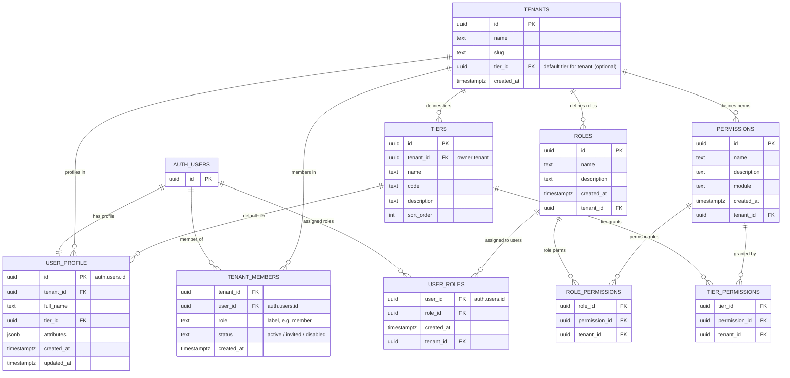
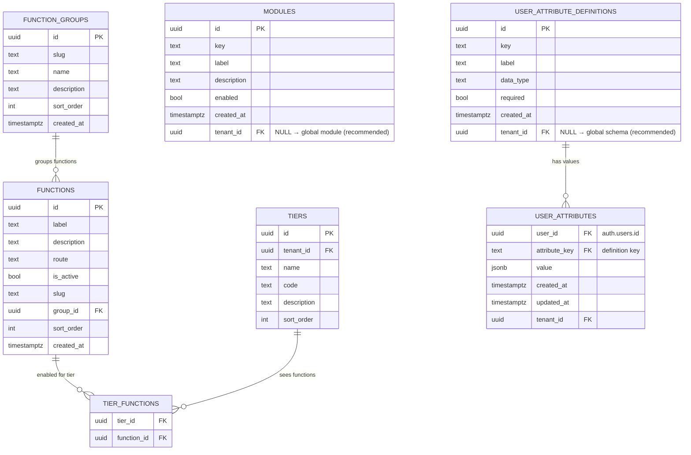

# Base Framework Database Reference

This document combines the **ER diagrams** and a **data dictionary** for the core database schema of the Base Framework multi-tenant SaaS platform.

It covers:

- **Core multi-tenant model** (tenants, tiers, users, profiles, membership)
- **RBAC** (roles, permissions, mappings, tier permissions)
- **Navigation & modules** (function groups, functions, tier functions, modules)
- **User attributes** (definitions and values)
- **Database functions & view** used for claims and admin reporting

## 1. Conventions & UUID Strategy

### 1.1 General conventions

- All core tables live in the `public` schema unless noted otherwise.
- `auth.users` (Supabase) is the **global identity** table.
- Business tables are **tenant-scoped** via `tenant_id` and protected with RLS.
- Primary keys are `uuid` unless stated otherwise.
- Timestamps use `timestamptz` (timestamp with time zone), defaulting to `now()`.
- Soft deletes are not used by default; instead, use status fields (`active`, `disabled`, etc.).

### 1.2 UUID generation (current & recommended practice)

In this schema, UUID primary keys are defined as:

```sql
id uuid DEFAULT gen_random_uuid() NOT NULL
```

Key points:

- `gen_random_uuid()` is provided by the `pgcrypto` extension (and in newer Postgres versions as a built-in).
- This is the **current recommended practice** for Postgres + Supabase:
  - No need to manage sequences manually.
  - Good randomness and low collision probability.
  - Works well with client-side libraries and Supabase tooling.
- You **do not** need a separate sequence for UUIDs. Sequences are typically used for `BIGSERIAL` / integer IDs.

Alternatives you might consider in future:

- **UUID v7 / ULID-style IDs** for better index locality and time-ordering. This can be implemented at the app layer or via Postgres extensions, but is optional.
- For now, sticking to `gen_random_uuid()` keeps things simple, standard, and aligned with Supabase defaults.

All tables below that have `id` as a primary key use this pattern unless otherwise noted.

## 2. ER Diagrams

### 2.1 Core Multi-tenant + User + RBAC

This view focuses on:

- **Tenants & tiers**: how tenants and their tiers are defined.
- **Users & profiles**: global Supabase users, plus per-tenant profile and membership.
- **RBAC**: roles, permissions, and mappings at tenant scope.
- **Tier → Permission mapping**: how monetization tiers drive permissions.



---

### 2.2 Tiers, Functions, Modules & User Attributes

This view focuses on:

- **Tiers → Functions**: which app functions (navigation routes) a tier can see/use.
- **Function groups**: grouping functions into logical sections of the app.
- **Modules**: global feature switches or groupings (white-label modules).
- **User attribute definitions & values**: configurable-but-global metadata on users.



## 3. Data Dictionary

### 3.1 auth.users (Supabase)

**Purpose**  
Global identity for every user. Authentication, email, password, and high-level metadata are managed by Supabase.

**Scope**  
Global (not tenant-specific). Tenant binding happens via `user_profile` and `tenant_members` / `user_roles`.

| Column (selected) | Type        | Description                                                       |
| ----------------- | ----------- | ----------------------------------------------------------------- |
| id                | uuid        | Primary key for the user, referenced by all tenant-scoped tables. |
| email             | text        | Login email address.                                              |
| raw_app_meta_data | jsonb       | Includes our `claims` JSON set by claims functions.               |
| created_at        | timestamptz | When the user record was created.                                 |

> Full structure is maintained by Supabase; we primarily reference `auth.users.id` and `raw_app_meta_data`.

### 3.2 tenants

**Purpose**  
Represents an **organisation / workspace** in the platform. Tenants own users, plans, and configuration.

**Scope**  
Tenant-scoped; each row is a tenant.

| Column     | Type        | Description                                                                                  |
| ---------- | ----------- | -------------------------------------------------------------------------------------------- |
| id         | uuid        | Primary key for the tenant.                                                                  |
| name       | text        | Human-readable tenant name (e.g. company name).                                              |
| created_at | timestamptz | When the tenant was created.                                                                 |
| slug       | text        | URL-safe identifier for the tenant (used in internal references or vanity URLs).             |
| tier_id    | uuid        | Optional reference to a default `tiers.id` (e.g. default plan for new users in this tenant). |

### 3.3 tiers

**Purpose**  
Defines **pricing plans** (e.g. `free`, `pro`, `enterprise`) for a tenant. These plans drive feature access and limits via permissions and functions.

**Scope**  
Tenant-scoped. In practice, system-level tiers can be reused across tenants.

| Column      | Type | Description                                           |
| ----------- | ---- | ----------------------------------------------------- |
| id          | uuid | Primary key for the tier.                             |
| tenant_id   | uuid | Owning tenant. May be `NULL` for global/system tiers. |
| name        | text | Display name (e.g. “Free”, “Pro”, “Enterprise”).      |
| description | text | Human-readable description of the plan.               |
| code        | text | Internal code (e.g. `free`, `pro`, `enterprise`).     |
| sort_order  | int  | Order for displaying tiers in UI.                     |

### 3.4 user_profile

**Purpose**  
Stores **per-tenant user profile** and primary SaaS attributes (tier, tenant, extra attributes). This is the bridge between `auth.users` and your multi-tenant business model.

**Scope**  
Tenant-scoped, 1:1 with `auth.users.id` in your target architecture (one primary tenant per user for now).

| Column     | Type        | Description                                                         |
| ---------- | ----------- | ------------------------------------------------------------------- |
| id         | uuid        | Primary key, FK to `auth.users.id`.                                 |
| tenant_id  | uuid        | Tenant the profile is attached to.                                  |
| full_name  | text        | User’s full name, copied from auth metadata on signup.              |
| attributes | jsonb       | JSON bucket for extra profile attributes (non-critical, non-typed). |
| tier_id    | uuid        | Current tier/plan of the user within this tenant.                   |
| created_at | timestamptz | Record creation timestamp.                                          |
| updated_at | timestamptz | Last update timestamp.                                              |

### 3.5 tenant_members

**Purpose**  
Tracks **membership** of a user within a tenant, including simple role labels and status. Supports scenarios where a user belongs to multiple tenants.

**Scope**  
Tenant-scoped. Composite key of (`tenant_id`, `user_id`).

| Column     | Type        | Description                                                   |
| ---------- | ----------- | ------------------------------------------------------------- |
| tenant_id  | uuid        | FK to `tenants.id`.                                           |
| user_id    | uuid        | FK to `auth.users.id`.                                        |
| role       | text        | Simple role label within the tenant (e.g. `member`, `admin`). |
| status     | text        | Membership status: `active`, `invited`, `disabled`, etc.      |
| created_at | timestamptz | When the membership record was created.                       |

### 3.6 roles

**Purpose**  
Defines **named roles** used for RBAC (e.g. `member`, `admin`, `super_admin`). In the target platform, these are **system-defined**, not tenant-customizable.

**Scope**  
Tenant-scoped at DB level, but conceptually **global role catalogue** in this framework.

| Column      | Type        | Description                                        |
| ----------- | ----------- | -------------------------------------------------- |
| id          | uuid        | Primary key for the role.                          |
| name        | text        | Role name (e.g. `member`, `admin`, `super_admin`). |
| description | text        | Longer description of the role’s purpose.          |
| created_at  | timestamptz | Creation timestamp.                                |
| tenant_id   | uuid        | Owning tenant; may be `NULL` for system roles.     |

### 3.7 permissions

**Purpose**  
Defines **fine-grained capabilities** that can be attached to roles and tiers (e.g. `create_project`, `view_admin_console`).

**Scope**  
Tenant-scoped at DB level; conceptually a **global permission catalogue**.

| Column      | Type        | Description                                                                     |
| ----------- | ----------- | ------------------------------------------------------------------------------- |
| id          | uuid        | Primary key for the permission.                                                 |
| name        | text        | Machine-friendly name of the permission.                                        |
| description | text        | Human-readable description of what this permission allows.                      |
| module      | text        | Logical module/feature this permission belongs to (e.g. `projects`, `billing`). |
| created_at  | timestamptz | Creation timestamp.                                                             |
| tenant_id   | uuid        | Owning tenant; may be `NULL` for system permissions.                            |

### 3.8 role_permissions

**Purpose**  
Join table mapping **roles → permissions**. Defines what each role is allowed to do.

**Scope**  
Tenant-scoped; each row is one “role has permission” link.

| Column        | Type | Description                     |
| ------------- | ---- | ------------------------------- |
| role_id       | uuid | FK to `roles.id`.               |
| permission_id | uuid | FK to `permissions.id`.         |
| tenant_id     | uuid | Tenant context of this mapping. |

### 3.9 user_roles

**Purpose**  
Assigns **roles to users** within a tenant. Typically this is derived from tiers plus rare super-admin overrides.

**Scope**  
Tenant-scoped. Composite PK of (`user_id`, `role_id`, `tenant_id`).

| Column     | Type        | Description                                  |
| ---------- | ----------- | -------------------------------------------- |
| user_id    | uuid        | FK to `auth.users.id`.                       |
| role_id    | uuid        | FK to `roles.id`.                            |
| created_at | timestamptz | When this role assignment was created.       |
| tenant_id  | uuid        | Tenant in which the role assignment applies. |

### 3.10 tier_permissions

**Purpose**  
Maps **tiers → permissions**, so plans define what users can do. This is the core of **tier-driven access control**.

**Scope**  
Tenant-scoped. Each row is one “tier grants permission” link.

| Column        | Type | Description                     |
| ------------- | ---- | ------------------------------- |
| tier_id       | uuid | FK to `tiers.id`.               |
| permission_id | uuid | FK to `permissions.id`.         |
| tenant_id     | uuid | Tenant context of this mapping. |

### 3.11 function_groups

**Purpose**  
Defines **groups of functions** that appear together in navigation (e.g. “Workspace”, “Admin”, “Account”).

**Scope**  
Global (no tenant_id).

| Column      | Type        | Description                                  |
| ----------- | ----------- | -------------------------------------------- |
| id          | uuid        | Primary key for the function group.          |
| slug        | text        | Stable identifier for the group.             |
| name        | text        | Display name in the UI.                      |
| description | text        | Optional description of the group’s purpose. |
| sort_order  | int         | Order for listing groups in navigation.      |
| created_at  | timestamptz | Creation timestamp.                          |

### 3.12 functions

**Purpose**  
Defines **individual functions / app entry points**, typically tied to routes (e.g. `/home`, `/admin/users`).

**Scope**  
Global (no tenant_id).

| Column      | Type        | Description                                           |
| ----------- | ----------- | ----------------------------------------------------- |
| id          | uuid        | Primary key for the function.                         |
| label       | text        | Display label for the function (e.g. “Dashboard”).    |
| description | text        | Optional description of the function.                 |
| route       | text        | Path or route this function links to (e.g. `/home`).  |
| is_active   | bool        | Whether this function is currently active/visible.    |
| slug        | text        | Stable identifier (e.g. `dashboard`).                 |
| group_id    | uuid        | FK to `function_groups.id`.                           |
| sort_order  | int         | Order in which the function appears within its group. |
| created_at  | timestamptz | When the function was created.                        |

### 3.13 tier_functions

**Purpose**  
Join table mapping **tiers → functions**, controlling which navigation items / functions each plan can access.

**Scope**  
Effectively global; tier IDs may be global/system tiers.

| Column      | Type | Description           |
| ----------- | ---- | --------------------- |
| tier_id     | uuid | FK to `tiers.id`.     |
| function_id | uuid | FK to `functions.id`. |

### 3.14 modules

**Purpose**  
Represents **high-level modules** (feature packs) that can be globally enabled/disabled (e.g. `projects`, `billing`, `analytics`).

**Scope**  
Conceptually global; `tenant_id` can be `NULL` (recommended) to indicate true white-label modules.

| Column      | Type        | Description                                                      |
| ----------- | ----------- | ---------------------------------------------------------------- |
| id          | uuid        | Primary key for the module.                                      |
| key         | text        | Unique key for the module (e.g. `projects`, `crm`).              |
| label       | text        | Display name for the module.                                     |
| description | text        | Optional human-readable description.                             |
| enabled     | bool        | Whether the module is globally enabled.                          |
| created_at  | timestamptz | When the module was created.                                     |
| tenant_id   | uuid        | Optional tenant-specific override (discouraged for white-label). |

### 3.15 user_attribute_definitions

**Purpose**  
Defines the **schema for custom-like user attributes**, centrally managed (not tenant-defined). Examples: `job_title`, `company_size`, `onboarding_stage`.

**Scope**  
Conceptually global. `tenant_id` may be `NULL` to indicate system-level definitions.

| Column     | Type        | Description                                             |
| ---------- | ----------- | ------------------------------------------------------- |
| id         | uuid        | Primary key for the attribute definition.               |
| key        | text        | Unique key (e.g. `job_title`).                          |
| label      | text        | Display label (e.g. “Job Title”).                       |
| data_type  | text        | Data type (e.g. `string`, `number`, `boolean`, `enum`). |
| required   | bool        | Whether this attribute is required.                     |
| created_at | timestamptz | When the definition was created.                        |
| tenant_id  | uuid        | Optional tenant-specific override; `NULL` = global.     |

### 3.16 user_attributes

**Purpose**  
Stores **actual values** for defined user attributes, referencing `auth.users` and `user_attribute_definitions.key`.

**Scope**  
Tenant-scoped; attributes can vary per tenant if needed.

| Column        | Type        | Description                                     |
| ------------- | ----------- | ----------------------------------------------- |
| user_id       | uuid        | FK to `auth.users.id`.                          |
| attribute_key | text        | FK to `user_attribute_definitions.key`.         |
| value         | jsonb       | Actual value for the attribute, stored as JSON. |
| created_at    | timestamptz | When this value was created.                    |
| updated_at    | timestamptz | When this value was last updated.               |
| tenant_id     | uuid        | Tenant context for the attribute value.         |

## 4. Database Functions

These functions wire Supabase auth, claims, and RBAC together.

### 4.1 public.build_claims(p_user_id uuid) → jsonb

**Purpose**  
Builds the **claims JSON** for a user, based on roles, tiers, and permissions.

Expected behaviour (from schema):

- Aggregates user’s roles and permissions via `user_roles`, `role_permissions`, and `permissions`.
- Returns a JSONB object with at least a `permissions` array and likely other fields (`roles`, `tier`, `tenant_id`).

This JSON is then written into `auth.users.raw_app_meta_data->'claims'` by `apply_claims_to_user`.

### 4.2 public.apply_claims_to_user(p_user_id uuid) → void

**Purpose**  
Recomputes and writes claims for a single user into Supabase `auth.users`.

Behaviour:

- Calls `public.build_claims(p_user_id)` to compute claims.
- Updates `auth.users.raw_app_meta_data` to set the `claims` key to the new JSONB.
- Is typically called:
  - After role assignments change for a user.
  - After tier changes or other RBAC-affecting events.

### 4.3 public.apply_claims_to_role_users() → trigger

**Purpose**  
Trigger function to **re-apply claims to all users of a given role** when the role or its permissions change.

Behaviour:

- Determines the relevant `role_id` from NEW/OLD rows.
- Iterates through `public.user_roles` for that role.
- Calls `public.apply_claims_to_user(user_id)` for each affected user.

Intended to be attached as a trigger on `role_permissions` / `roles`.

### 4.4 public.get_role_permissions(role_id uuid) → TABLE(permission text)

**Purpose**  
Utility to fetch all permission names for a given role.

Usage:

- `SELECT * FROM public.get_role_permissions(<role_id>);`
- Used internally for diagnostics or when building admin screens.

### 4.5 public.get_user_permissions(user_id uuid) → TABLE(permission text)

**Purpose**  
Utility to fetch all permission names for a given user via role mappings.

Usage:

- `SELECT * FROM public.get_user_permissions(<user_id>);`
- Reflects the **effective** permissions (post role assignment).

### 4.6 public.user_has_permission(user_id uuid, permission_name text) → boolean

**Purpose**  
Convenience helper to check whether a given user has a named permission.

Behaviour:

- Performs an `EXISTS` query joining `user_roles`, `role_permissions`, and `permissions`.
- Returns `true` if the user has the specified permission, `false` otherwise.

Useful inside RLS policies or admin diagnostic SQL.

### 4.7 public.on_auth_user_created() → trigger

**Purpose**  
Bootstrap logic that runs when a new row is inserted into `auth.users` (user signup).

Typical behaviour (from the function body in schema):

- Resolves or creates an initial tenant (e.g. “Unassigned Tenant” or similar).
- Inserts a row into `public.user_profile` with:
  - `id = new.id`
  - `full_name` from `raw_user_meta_data->>'full_name'`
  - `tenant_id` and a default `tier_id` (free tier).
- Optionally assigns default tier/role mappings (e.g. FREE tier, MEMBER role).
- Calls `apply_claims_to_user` to initialise JWT claims for the new user.

## 5. Views

### 5.1 public.tenant_members_admin

**Purpose**  
Admin-focused **denormalised view** showing tenant memberships with enriched information for dashboards and support tooling.

Definition (simplified):

```sql
CREATE OR REPLACE VIEW public.tenant_members_admin AS
SELECT
  ur.tenant_id,
  t.name     AS tenant_name,
  ur.user_id,
  u.email    AS user_email,
  ur.role_id,
  r.name     AS role_name,
  up.tier_id,
  tr.name    AS tier_name,
  ur.created_at
FROM public.user_roles ur
JOIN public.tenants t       ON t.id  = ur.tenant_id
JOIN auth.users u           ON u.id  = ur.user_id
LEFT JOIN public.roles r    ON r.id  = ur.role_id
LEFT JOIN public.user_profile up ON up.id = ur.user_id
LEFT JOIN public.tiers tr   ON tr.id = up.tier_id;
```

**Columns**

| Column      | Type        | Description                                |
| ----------- | ----------- | ------------------------------------------ |
| tenant_id   | uuid        | Tenant ID.                                 |
| tenant_name | text        | Tenant display name.                       |
| user_id     | uuid        | User ID (auth.users.id).                   |
| user_email  | text        | User’s email from auth.                    |
| role_id     | uuid        | Role ID assigned via user_roles.           |
| role_name   | text        | Role name.                                 |
| tier_id     | uuid        | User’s current tier from user_profile.     |
| tier_name   | text        | Tier name.                                 |
| created_at  | timestamptz | When the user role assignment was created. |

## 6. Why a Data Dictionary Isn’t “Old School”

Maintaining a data dictionary in Markdown like this is still a **best practice**, especially for a reusable white-label SaaS platform:

- Gives **non-engineers** (product, ops, IR/finance) a clear view of what data exists and how it’s used.
- Supports **safe migrations** and RLS changes by making assumptions explicit.
- Makes multi-module evolution easier: every new module should align to these core entities instead of re-inventing them.
- Plays nicely with generated docs (e.g. Supabase dashboard) by adding **business meaning** on top of raw schema.

Treat this document as **living documentation**: update it whenever you change the core schema or add a new platform module.
